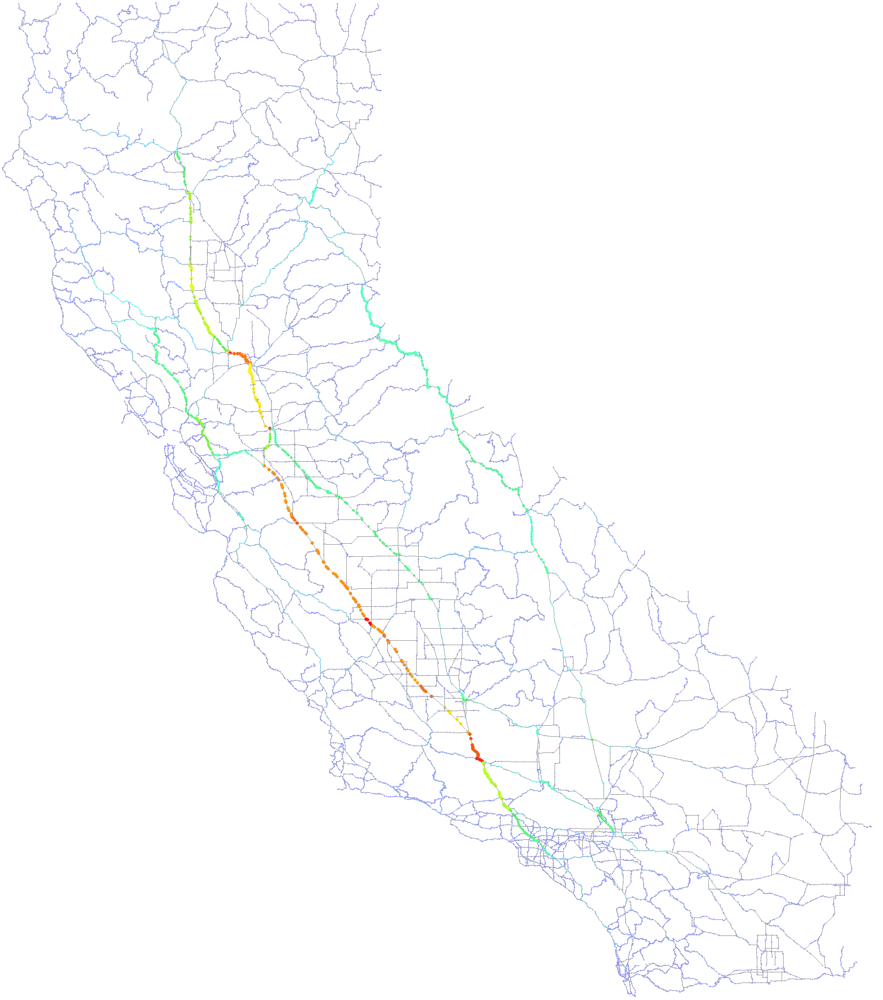

# California Road

## Introduction

This project uses the Road Network of California dataset from https://www.cs.utah.edu/~lifeifei/SpatialDataset.htm. Most of the tools in *drawing* directory are from CS 225 course at UIUC.

This program has two main functions.
1. Calculate the shortest distance between any two places in California using Dijkstra's algorithm
2. Calculate the betweenness centrality of all vertices in the road network of California using Brandes' algorithm.

For (1), the calculate paths will be saved to the directory *generated_paths*. For (2), a brandes_results.txt file will be saved to the current directory, and a .png file will be saved for visualization. Following is the visualization of the result of the algorithm:

The red line is actually the I-5 Interstate! Due to the long runtime, (2) is based on a multithreading implementation.

## How to use

This program is compiled using *Makefile*. To compile the program, go to the current directory and type in terminal:

`make`

Please have the relevant tools installed:
`sudo apt-get install build-essential`
`sudo apt-get install libc++abi-dev`
`sudo apt-get install libc++-14-dev`
Note that the dependencies must have the same version as clang++.

To run the compiled program, type in terminal:

`./main`

Then user can follow the instructions provided by the program.
